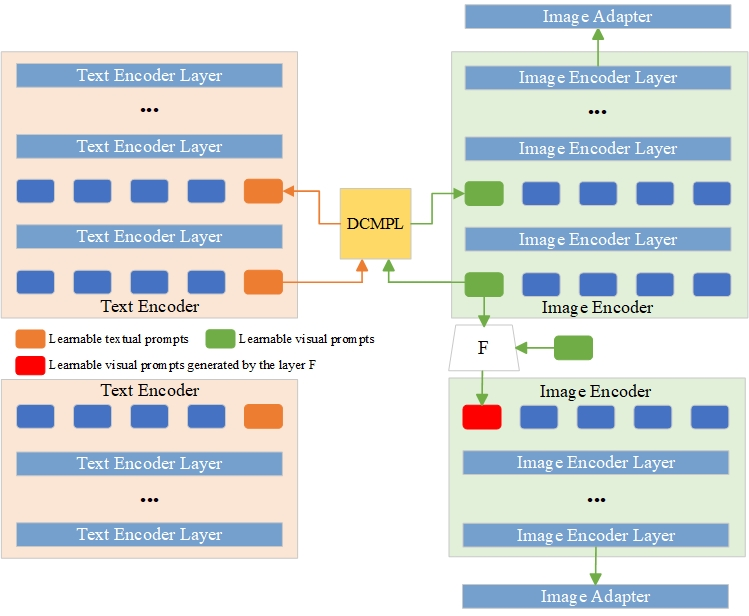

# DCMPL-AGIQA: A Deep Cross-Modal Prompt Learning Approach for AI-Generated Image Quality Assessment

**Abstract:**In recent years, the application of multimodal vision-language pre-trained models (such as CLIP) to Artificial Intelligence Generated Image Quality Assessment (AIGCIQA) tasks has become increasingly prevalent. Related methods have made significant contributions to the study of AIGCIQA through text and visual prompt learning. However, our research has found that existing AIGCIQA methods often focus only on a single branch (either language or visual) or fail to fully consider the synergy between text and images, resulting in suboptimal performance. To address this, we propose a Deep Cross-Modal Prompt Learning method for AIGCIQA (DCMPL-AGIQA). This method designs an auxiliary task that connects multi-head attention modules to gradually enhance the coupling between learnable text and visual prompts. The knowledge of visual-language synergy acquired from the auxiliary task is utilized to guide multimodal prompt learning in the main task. Additionally, we introduce an extra bottleneck layer (Image Adapter) in the visual branch to learn new features and refine the original pretrained features through residual-style feature fusion. Experimental results on multiple generated image datasets (such as AGIQA-3K, AIGCIQA2023, and AGIQA-1K) demonstrate that the proposed method outperforms existing state-of-the-art image quality assessment models.
# Datasets
You can download datasets [AGIQA-3k](https://drive.google.com/file/d/1zpIuzdiPk5PIPdpXrfZb3Xq09PpJ-8iO/view), [AIGCIQA2023]() and [AGIQA-1k](https://drive.google.com/drive/folders/1umhyTM1FF3h7YYp-68C2xPEuLqMKaNlt?usp=drive_link). Next, update the dataset path accordingly.
# Checkpoint
You can download the trained model weights [checkpoint]() for testing.
